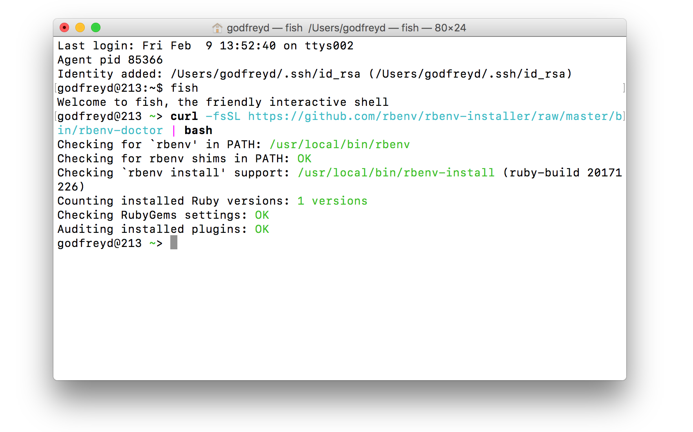
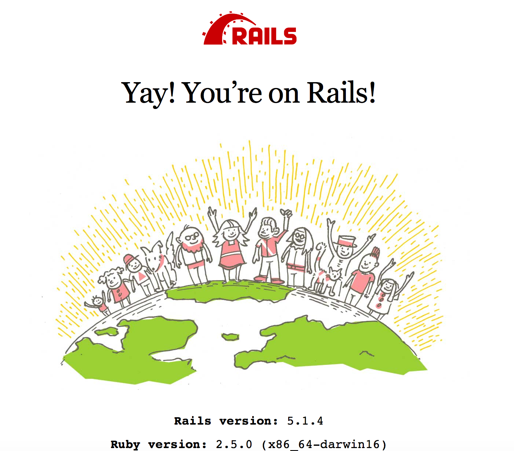
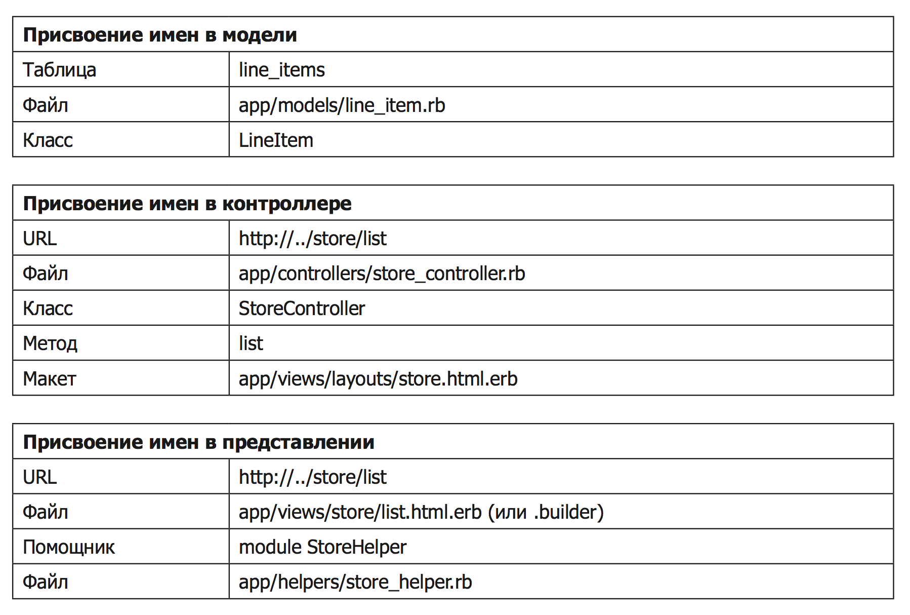
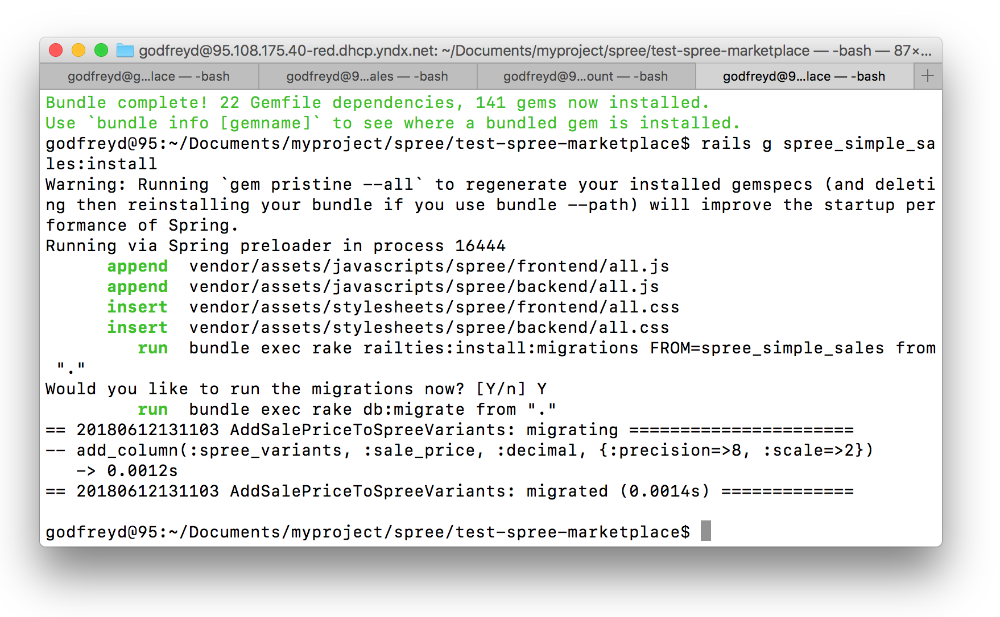

# Marketplace

Online marketplace step by step.

1. [Подготовка рабочей среды](#Подготовка-рабочей-среды)
	* [Установка Ruby Version Manager](#Установка-ruby-version-manager)
	* [Установка rbenv](#Установка-rbenv)
	* [Установка Ruby](#Установка-ruby)
	* [Установка Rails](#Установка-rails)
	* [Установка Bundler](#Установка-bundler)
	* [Установка Image Magick](#Установка-image-magick)
	* [Установка Postgres](#Установка-postgres)
2. [Выбор версии Rails](#Выбор-версии-rails)
3. [Использование rbenv](#Использование-rbenv)
4. [Создание Rails-приложения](#Создание-rails-приложения)
5. [Файловая структура Rails-приложения](#Файловая-структура-rails-приложения)
6. [Соглашение по именованию](#Соглашение-по-именованию)
7. [Диагностическая информация](#Диагностическая-информация)
8. [Создание Spree e-commerce платформы](#Создание-spree-e-commerce-платформы)
9. [Миграция с Sqlite3 → Postgres](#Миграция-с-sqlite3--postgres)
10. [Добавление расширений Spree](#Добавление-расширений-spree)
    * [Установка SpreeI18n](#Установка-spreei18n)
11. [Создание собственных расширений Spree](#Создание-собственных-расширений-spree)
	* [Sale](#sale)
12. [Работа с Deface](#Работа-с-deface)
13. [Настройка Spree](#Настройка-spree)
    * [Производительность](#Производительность)
14. [FAQ](#faq)

См. также:

* [`docs/rails`](docs/rails/README.md) — введение в Rails.
* [`docs/ruby`](docs/ruby/README.md) — введение в Ruby.
* [`docs/rake`](docs/rake/README.md) — введение в Rake.
* [`docs/postgres`](docs/postgres/README.md) — работа с Postgres.
* [`docs/react`](docs/react/README.md) — руководство по переходу и работе с React.js.
* [`docs/problems`](docs/problems/README.md) — проблемы и решения.

## Подготовка рабочей среды

###  Установка Ruby Version Manager

[RVM](https://rvm.io) — менеджер пакетов Ruby.

```bash
$ \curl -sSL https://get.rvm.io | bash -s stable
```

**Проверка**

Чтобы RVM работал корректно, он должен быть функцией. Чтобы проверить, что RVM является функцией, выполните команду:

```bash
$ type rvm | head -n 1
```

Чтобы проверить все доступные версии Ruby в RVM, выполните команду:

```bash
$ rvm list known
```

### Установка rbenv

[rbenv](https://github.com/rbenv/rbenv) — утилита для установки и переключения пакетов Ruby. Используется совместно с [ruby-build](https://github.com/rbenv/ruby-build)

```bash
$ brew install rbenv ruby-build
```

**Проверка**

Чтобы проверить какая версия `rbenv` установлена, выполните команду:

```bash
$ rbenv -v
```

**Обновление**

```bash
$ brew upgrade rbenv ruby-build
```

**Настройка**

1. Выполните команду:

	```bash
	$ rbenv init
	```

2. Добавьте следующий код в файл `~/.bash_profile`:

	```text
	eval "$(rbenv init -)"
	```

3. Убедитесь, что rbenv правильно настроен:

	```bash
	$ curl -fsSL https://github.com/rbenv/rbenv-installer/raw/master/bin/rbenv-doctor | bash
	```

	Ответ

	

### Установка Ruby

С помощью [Homebrew](https://brew.sh/index_ru.html):

```bash
$ brew install ruby
```

С помощью [RVM](https://rvm.io):

```bash
$ rvm install ruby 2.5.0
```

С помощью [rbenv](https://github.com/rbenv/rbenv):

```bash
$ rbenv install 2.5.0
```

**Проверка**

Чтобы проверить какая версия Ruby установлена, выполните команду:

```bash
$ ruby -v
```

или (если установлен менеджер пакетов [RVM](#ruby-version-manager))

```bash
$ rvm list
```

### Установка Rails

Rails — это фреймворк для разработки приложений, написанный на языке Ruby.

С помощью RubyGems:

```bash
# Install the last version Rails
$ gem install rails
# Install Rails 5.2.0
$ gem install rails -v 5.2.0
```

**Проверка**

Чтобы проверить какая версия используется, выполните команду:

```bash
$ rails -v
```

### Установка Bundler

[Bundler](http://bundler.io) — менеджер установки gem'ов нужных версий, которые будут корректно работать друг с другом.

```bash
$ gem install bundler
```

### Установка ImageMagick

 Spree использует библиотеку [ImageMagick](http://www.imagemagick.org) для управления изображениями. Позволяет автоматически изменять размер, сжимать и изменять изображения.

```bash
$ brew install imagemagick
```

### Установка Postgres

Чтобы установить Postgres на компьютер, выполните команду:

```bash
$ brew install postgresql
```

## Выбор версии Rails

1. Проверьте все установленные версии Rails:

	```bash
	$ gem list --local rails
	```

2. Проверьте какая версия Rails запускается по умолчанию:

	```bash
	rails --version
	```

3. Установите необходимую версию Rails:

	```bash
	$ rvm gemset empty
	$ rvm gemset create
	$ gem install rails -v '5.2.0'
	```

## Использование rbenv

```bash
# As an rbenv plugin
$ rbenv install --list                 # lists all available versions of Ruby
$ rbenv install 2.5.0                  # installs Ruby 2.5.0 to ~/.rbenv/versions
$ rbenv global 2.5.0				   # Activate Ruby 2.5.0

# As a standalone program
$ ruby-build --definitions             # lists all available versions of Ruby
$ ruby-build 2.5.0 ~/local/ruby-2.5.0  # installs Ruby 2.5.0 to ~/local/ruby-2.5.0
```

## Создание Rails-приложения

> **Примечание.** Spree зависит от определенной версии Rails. Подробно о нужной версии можно узнать из [документации](https://guides.spreecommerce.org/developer/getting_started_tutorial.html#creating-a-new-spree-project).

Чтобы создать приложение, выполните команду:

```bash
$ rails new marketplace
```

Приложение успешно создано. Перейдите в директорию `spree-marketplace` и запустите сервер.

```bash
$ cd spree-marketplace
$ rails server
```

> **Примечание.** При запуске приложения в терминале выведится сообщение о том, что сервер выполняется на порте 3000. Откройте браузер и введите адрес [localhost:3000](http://localhost:3000).

Чтобы запустить сервер на другом порту (например, 9000), выполните команду:

```bash
$ rails server -p 9000
```

Ответ



> **Примечание.** По умолчанию Rails использует сервер WEBrick. Но если на машинке установлен другой веб-сервер (и Rails может его найти), команда rails server может предпочесть его серверу WEBrick.

## Файловая cтруктура Rails-приложения

```bash
app/					# Модели, представления, контроллеры и статика
	assets/				# Картинки, JS- и CSS-файлы приложения
		config/
			manifest.js		
		images/			# Изображения
		javascript/		# JS-файлы, по умолчанию `coffee`
		stylesheets/	# Стили, по умолчанию `scss`
	channels/
	controllers/
	helpers/
	jobs/
	mailers/
	models/
	views/
		layouts/
			application.html.erb	# Макет приложения
			mailer.html.erb			# Макет письма для отправки
			mailer.text.erb			# Шаблон текста письма

bin             # Rails-скрипты для старта приложения
config          # Конфигурации маршрутов, базы данных приложения
	database.yml		# [YAML]( http://www.yaml.org/)-конфигурация базы данных приложения
	boot.rb				# Сценарий начальной загрузки приложения (редактировать его не стоит)
	environment.rb 		# Файл в котором определяются параметры запуска приложения
db						# Схема данных и информация о миграции
	migrate/ 			# Файлы миграции
	schema.rb			# Текущая схема базы данных SQLite 3
	seeds.rb			# Файл помогает импортировать исходные данные в базу данных
lib             		# Общий код не связынный с контроллерами, моделями и представлениями. Например, код, генерирующий чеки, документацию для отправки заказа покупателю и другие документы в формате PDF. Подкаталоги можно группировать по своему назначению.
	assets/
	tasks/				# Собственные Rack-задачи, позволяющие добавлять автоматику к проекту
log             		# Файлы логов (протоколов)
public          		# Каталог доступный из интернета, откуда запускается приложение
test            		# Юнит-тесты
tmp             		# Временные файлы: подкаталоги для кэш-содержимого, сессий и сокетов
vendor          		# Внешние gem'ы, aka node_modules
	rails/				# Этой директории нет, но если будет желание пересесть на «Острие Rails», то можно скачать сюда необходимую версию и выполнить заморозку проекта к конкретной версии: `rails:freeze:edge` и `rails:unfreeze`. Сейчас в этом совсем нет необходимости.
config.ru       		# Конфигурация Rack-сервера
Gemfile         		# Gem-зависимости
Gemfile.lock    		# Записи о конкретных версиях каждого пакета
package.json    		# npm-зависимости
Rakefile        		# Задачи, которые могут быть запущены в командной строке. Полный список задач: rake -T, описание конкретной задачи: rake -D задача
README.md       		# Описание
```

### Каталог lib

В предыдущих версиях Rails файлы в каталоге `lib` автоматически включались в путь загрузки, используемый для выполнения инструкций require  Теперь это элемент настройки, который нужно включить явным образом. Для этого в файл `config/application.rb` следует включить строку:

`config.autoload_paths += %W(#{Rails.root}/lib)`

Когда у вас будут файлы в каталоге `lib` и этот каталог будет добавлен в ваши пути автозагрузки (autoload_paths), вы сможете ими воспользоваться во всем остальном приложении. Если файлы содержат классы или модули и файлы названы с использованием имени класса или модуля в форме букв нижнего разряда, тогда Rails загрузит такой файл автоматически. Например, у нас может быть составитель чека в формате PDF, который находится в файле `receipt.rb` в каталоге `lib/pdf_stuff`.

Если только наш класс носит имя `PdfStuff::Receipt`, Rails сможет найти и загрузить его автоматически. Для тех случаев, когда библиотека не может отвечать условиям автоматической загрузки, необходимо использовать имеющийся в Ruby механизм запроса, использующий инструкцию `require`. Если файл находится в каталоге `lib`, его можно запрашивать непосредственно по имени. Например, если наша библиотека вычисления дня Пасхи находится в файле `lib/easter.rb`, мы можем включить ее в любую модель, представление или контроллер, используя следующую инструкцию:

`require "easter"`

Если библиотека находится в подкаталоге каталога `lib`, нужно не забыть включить имя этого подкаталога в инструкцию `require`. Например, для включения калькулятора доставки авиапочтой можно добавить следующую строку кода:

`require "shipping/airmail"`

## Соглашение по именованию

В Ruby применяется соглашение, при котором имена переменных пишутся в нижнем регистре, а слова разделяются знаком подчеркивания. Классы и модули именуются по-другому: в их именах не используется знак подчеркивания, а каждое слово фразы (включая первое) пишется с заглавной буквы.

**Пример**

Класс `LineItem` определяется в файле с именем `line_item.rb`, в каталоге `app/models`.

На основе этого имени Rails автоматически придет к следующему заключению: соответствующая таблица базы данных будет названа `line_items` (во множественном числе).

Контроллеры Rails имеют дополнительные соглашения об именах. Если в нашем приложении есть контроллер `store`, происходит следующее:

* Rails предполагает, что класс называется `StoreController` и находится в файле `store_controller.rb` каталога `app/controllers`.
* Rails также ищет вспомогательный модуль по имени `StoreHelper`, который находится в файле `store_helper.rb` каталога `app/helpers`.
* Rails станет искать шаблоны представлений для этого контроллера в каталоге `app/views/store`. 
* Rails будет по умолчанию брать код вывода на экран для этих представлений и рассматривать его как макеты шаблонов, находящихся в файле `store.html.erb` или `store.xml.erb` в каталоге `app/views/layouts`.

Все эти соглашения показаны в следующей таблице:




## Диагностическая информация 

Чтобы увидеть на экране диагностическую информацию о приложении, запустите сервер и перейдите по ссылке [http://localhost:3000/rails/info/properties](http://localhost:3000/rails/info/properties).

## Создание Spree e-commerce платформы

Чтобы добавить Spree:

1. Перейдите в директорию проекта.

   ```bash
   $ cd spree-marketplace
   ```

2. Добавьте gem'ы в Gemfile. Подробно о нужных версиях gem'ов можно узнать из [документации](https://github.com/spree/spree#getting-started). Текущие gem'ы используются для Rails 5.2.

	```text
	gem 'spree', '~> 3.6.3'
	gem 'spree_auth_devise', '~> 3.3'
	gem 'spree_gateway', '~> 3.3'
	```

3. Устанавите добавленные gem'ы.

	```bash
	$ bundle install
	```

    > **Примечание.** Чтобы обновить установленные ранее gem'ы, выполните команду `bundle update`. Чтобы увидеть куда gem был установлен, выполните команду: `bundle info [gemname]`.

4. Запустите установщик Spree.

	```bash
	$ rails generate spree:install --user_class=Spree::User
	$ rails generate spree:auth:install
	$ rails generate spree_gateway:install
	```

5. Запускаем сервер.

   ```bash
   $ rails server
   ```

   При запуске приложения в терминале выведится сообщение о том, что сервер выполняется на порте 3000. Откройте браузер и введите адрес [localhost:3000](http://localhost:3000).

   > **Примечание.** Если порт 3000 занят, его можно переназначить (например, на 9000).
   >
   > ```bash
   > $ rails server -p 9000
   > ```

## Миграция с Sqlite3 → Postgres

По умолчанию Spree настроен на работу с базой данных Sqlite3. Она отлично подходит для демонстрации тестового проекта, но не для продакшн marketplace.

Чтобы настроить Rails-приложение на работу с MySQL, Oracle, Postgres или SQL Server, необходимо установить одну из бублиотек, которую Rails сможет использовать для подключения и взаимодействия с базой данных.

Библиотеки:

* MySQL — [mysql-ruby](http://www.tmtm.org/en/mysql/ruby/).
* Oracle — [ruby-oci8](http://rubyforge.org/projects/ruby-oci8).
* Postgres — [pg](https://rubygems.org/gems/pg/versions/0.18.4).
* SQL Server — [rails-sqlserver](https://github.com/rails-sqlserver).

У каждой из этих БД есть свои плюсы и минусы. Для нашего marketplace мы выбрали [PostgreSQL](http://www.postgresql.org/).

Чтобы выполнить миграцию Sqlite3 → Postgres:

1. [Установите библиотеку pg](#Установка-pg).
2. [Создайте базы данных](#Создание-баз-данных).
3. [Настройте приложение на работу с Postgres](#Настройка-приложения-на-работу-с-postgres)
4. [Выполните миграцию Sqlite3 → Postgres](#Миграция-sqlite3--postgres)

### Установка pg

[Pg](https://rubygems.org/gems/pg/versions) — это библиотека Ruby, которая представляет интуитивный веб-интерфейс для управления базами данных PostgreSQL.

> **Примечание.** Версия `pg` очень важна.

**Первый способ**

Чтобы установить `pg`, выполните команду:

```bash
$ gem install pg -v 0.18.4
```

**Второй способ**

1. Добавьте бублиотеку `pg` в Gemfile:

	```bash
	$ gem 'pg', '~> 0.18.4'
	```

2. Установите добавленный gem.

	```bash
	$ bundle install
	```

### Создание баз данных

Создадим следующие базы данных:

* `spreemarketplacedev` — для разработки;
* `spreemarketplacetest` — для тестирования; 
* `spreemarketplaceprod` — для продакшн.

Чтобы создать базы данных:

1. Войдите в Postgres.

   ```bash
   $ psql
   ```

2. Выполните следующие команды:

   ```sql
   CREATE DATABASE spreemarketplacedev;
   CREATE DATABASE spreemarketplacetest;
   CREATE DATABASE spreemarketplaceprod;
   ```

### Настройка приложения на работу с Postgres

Отредактируйте файл [/config/database.yml](/config/database.yml):

```yml
# Postgres
#   gem install pg
#
#   Ensure the Postgres gem is defined in your Gemfile
#   gem 'pg', '~> 0.18'
#
default: &default
  adapter: postgresql
  pool: <%= ENV.fetch("RAILS_MAX_THREADS") { 5 } %>
  encoding: utf8
  timeout: 5000

development:
  <<: *default
  host: localhost
  database: spreemarketplacedev
  username: godfreyd
  password: ss$0psrc*

test:
  <<: *default
  database: spreemarketplacetest
  username: godfreyd
  password: ss$0psrc*

production:
  <<: *default
  database: spreemarketplaceprod
  username: godfreyd
  password: ss$0psrc*
```

> **Важно!** При использовании табов может возникать синтаксическая ошибка.

### Миграция Sqlite3 → Postgres

Чтобы смигрировать с Sqlite3 на Postgres, выполните команду:

```bash
$ rake db:migrate
```

Готово! Миграция выполнена. Перейдите в директорию `spree-marketplace` и запустите сервер.

```bash
$ cd spree-marketplace
$ rails server
```

Проверка приложения:

При запуске приложения в терминале выведится сообщение о том, что сервер выполняется на порте 3000. Откройте браузер и введите адрес [localhost:3000](http://localhost:3000).

Проверка админки:

Перейдите по адресу [localhost:3000/admin](http://localhost:3000/admin) и ведите e-mail: `spree@example.com` и пароль: `spree123`.

> **Примечание.** Если вы не использовали параметр `--auto-accept` при добавлении Spree в приложение Rails и не установили исходные данные, пользователь `admin` не будет существовать в вашей базе данных.

Чтобы создать нового администратора, выполните команду:

```bash
$ rake spree_auth:admin:create
```

## Добавление расширений Spree

### Установка SpreeI18n

* [GitHub](https://github.com/spree-contrib/spree_i18n)
* [Документация](https://guides.spreecommerce.org/developer/i18n.html)
 
Чтобы установить SpreeI18n:

1. Добавьте gem в Gemfile.

   ```text
   gem 'spree_i18n', github: 'spree-contrib/spree_i18n', branch: 'master'
   ```

2. Устанавите добавленный gem.

   ```bash
   $ bundle install
   ```

3. Запустите установщик Spree.

   ```bash
   $ bundle exec rails g spree_i18n:install
   ```

## Создание собственных расширений Spree

Добавление дополнительной функциональности в Spree реализуется через расширения, которые затем встраиваются в приложение.

> **Важно!** Расширения создаются вне самого приложения Spree.

Создайте директорию `spree-extensions`, для удобства разработки расширений.

```bash
$ mkdir spree-extensions
```

### Sale

Давайте создадим расширение `simple_sales`, чтобы иметь возможность назначать скидку на определенные товары.

* [Создание шаблона расширения](#Создание-шаблона-расширения)
* [Создание миграции](#Создание-миграции)
* [Установка расширения](#Установка-расширения)
* [Создание контроллера](#Создание-контроллера)
* [Добавление скидки товару](#Добавление-скидки-товару)
* [Создание представления](#Создание-представления)
* [Переопределение представления Spree](#Переопределение-представления-spree)
* [Тестирование расширения](#Тестирование-расширения)

#### Создание шаблона расширения

1. Перейдите в директорию `spree-extensions`.

	```bash
	$ cd spree-extensions
	```

2. Выполните команду:

	```bash
	$ spree extension simple_sales
	```

  > **Примечание.** Эта команда создаст каталог `spree_simple_sales` с необходимыми файлами и каталогами.

Шаблон расширения готов!

#### Создание миграции

Первое, что необходимо сделать — создать миграцию в БД, которая добавит столбец `sale_price` к таблице с [вариантами](https://guides.spreecommerce.org/developer/products.html#variants). Вариантами в Spree называют индивидуальные/изменяемые свойства продукта, такие как высота, ширина, глубина и себестоимость. Подробнее про [свойства продукта](https://guides.spreecommerce.org/developer/products.html#product-properties).

Чтобы создать миграцию в БД:

1. Перейдите в директорию созданного расширения.

	```bash
	$ cd spree_simple_sales
	```

2. Выполните команду:

	```bash
	$ bundle install
	$ bundle exec rails g migration add_sale_price_to_spree_variants sale_price:decimal
	```

	**Ответ**

	```bash
	Running via Spring preloader in process 5327
    	invoke  active_record
    	create    db/migrate/20180612131103_add_sale_price_to_spree_variants.rb
	```

3. Отредактируйте файл `db/migrate/XXXXXXXXXXX_add_sale_price_to_spree_variants.rb`, чтобы обеспечить точность и масштаб: 

	```rb
	class AddSalePriceToSpreeVariants < SpreeExtension::Migration[5.2]
		def change
			add_column :spree_variants, :sale_price, :decimal, precision: 8, scale: 2
		end
	end
	```

	> **Примечание.** Измените наследование от `ActiveRecord:: Migration` на `Spree::Migration` для поддержки нескольких версий Rails.

Миграция готова!

#### Установка расширения

Чтобы установить расширение:

1. Перейдите в директорию проекта.

	```bash
	$ cd spree-marketplace
	```

2. Добавьте gem расширения `spree_simple_sales` в Gemfile приложения. 

	```text
	gem 'spree_simple_sales', path: '../spree-extensions/spree_simple_sales'
	```

3. Выполните команду:

	```bash
	$ bundle install
	```

4. Запустите установщик Spree, чтобы скопировать миграцию, которую мы создали (ответьте «Да», если будет предложено запустить миграцию).

	```bash
	$ rails g spree_simple_sales:install
	```

	Ответ:

	


Расширение `spree_simple_sales` установлено!

#### Создание контроллера

Добавим событие в `Spree::HomeController`, по которому будут выбираться товары со скидками.

1. Перейдите в директорию расширения `spree_simple_sales`.

	```bash
	$ cd spree_simple_sales
	```

2. Выполните команду:

	```bash
	$ mkdir -p app/controllers/spree
	```

3. Создайде файл `app/controllers/spree/home_controller_decorator.rb`.
4. Добавьте в файл `home_controller_decorator.rb` следующий код:

	```rb
	Spree::HomeController.class_eval do
		def sale
			@products = Spree::Product.joins(:variants_including_master).where('spree_variants.sale_price is not null').distinct
		end
	end
	```

  > **Примечание.** Это позволит выбрать только те продукты, которые имеют вариант с набором `sale_price`.

4. Добавьте маршрут к этому действию в файл `config/routes.rb`. 

	```rb
	Spree::Core::Engine.routes.draw do
		get "/sale" => "home#sale"
	end
	```

Контроллер готов!

#### Добавление скидки товару

Чтобы добавить скидку товару:

1. Перейдите в директорию проекта.

	```bash
	$ cd spree-marketplace
	```

2. Перейдите в Rails-консоль:

	```bash
	$ rails console
	```

	> **Примечание.** Добавить скидку можно через панель администратора. Это мы рассмотрим позже.

3. Выполните следующие действия (в примере мы выставляем скидку 8 продукту с `id` равным 1):

	```bash
	> product = Spree::Product.first
	=> #<Spree::Product id: 1, name: "Ruby on Rails Tote", description: "Quae est vitae minus maxime veniam distinctio. Per...", available_on: "2018-06-12 12:57:53", deleted_at: nil, slug: "ruby-on-rails-tote", meta_description: nil, meta_keywords: nil, tax_category_id: 1, shipping_category_id: 1, created_at: "2018-06-12 12:57:53", updated_at: "2018-06-12 12:59:02", promotionable: true, meta_title: nil, discontinue_on: nil>

	> variant = product.master
	=> #<Spree::Variant id: 1, sku: "ROR-00011", weight: 0.0, height: nil, width: nil, depth: nil, deleted_at: nil, is_master: true, product_id: 1, cost_price: 0.17e2, position: 1, cost_currency: "USD", track_inventory: true, tax_category_id: nil, updated_at: "2018-06-12 12:59:02", discontinue_on: nil, created_at: "2018-06-12 12:57:53", sale_price: nil>

	> variant.sale_price = 8.00
	=> 8.0

	> variant.save
	=> true
	> exit
	```

Товару с `id` = 1 добавлена скидка = 8.0!

#### Создание представления

Чтобы отобразить товары со скидкой:

1. Перейдите в директорию расширения `spree_simple_sales`.

	```bash
	$ cd spree_simple_sales
	```

2. Выполните команду:

	```bash
	$ mkdir -p app/views/spree/home
	```

3. Создайте файл `app/views/spree/home/sale.html.erb`.
4. Добавьте в него следующий код:

	```html
	<div data-hook="homepage_products">
		<%= render 'spree/shared/products', products: @products %>
	</div>
	```

Представление готово! Чтобы убедиться, что контроллер отвечает, запустите приложение и перейдите по адресу [localhost:3000/sale](http://localhost:3000/sale).

#### Переопределение представления Spree

Давайте переопределим отображение цены в расширение так, чтобы оно использовало `sale_price`, когда `sale_price` присутствует у товара. Все действия необходимо выполнять в директории расширения, чтобы не потерять возможность обновлять Spree.

1. Перейдите в директорию расширения `spree_simple_sales`.

	```bash
	$ cd spree_simple_sales
	```

2. Создайте необходимые каталоги.

	```bash
	$ mkdir -p app/models/spree
	```

2. Создайте файл `app/models/spree/variant_decorator.rb`.

3. Добавьте в него следующее содержимое:

	```rb
	Spree::Variant.class_eval do
		alias_method :orig_price_in, :price_in
		def price_in(currency)
			return orig_price_in(currency) unless sale_price.present?
			Spree::Price.new(variant_id: self.id, amount: self.sale_price, currency: currency)
		end
	end
	```

Должна отображаться цена скидки!

#### Тестирование расширения

Напишем несколько модульных тестов для `app/models/spree/variant_decorator.rb`

1. Перейдите в директорию расширения `spree_simple_sales`.

	```bash
	$ cd spree_simple_sales
	```

2. Выполните команду:

	```bash
	$ bundle exec rake test_app
	```

	**Ответ**

	```bash
	No examples found.

	Finished in 0.00005 seconds
	0 examples, 0 failures
	```

Чтобы создать тест:

1. Создайте необходимые каталоги:

    ```bash
    $ mkdir -p spec/models/spree
    ```

2. Создайте файл `spec/models/spreevariant_decorator_spec.rb`
3. Добавьте в `spreevariant_decorator_spec.rb` следующий код:

    ```rb
    require 'spec_helper'

	describe Spree::Variant do
	describe "#price_in" do
		it "returns the sale price if it is present" do
		variant = create(:variant, sale_price: 8.00)
		expected = Spree::Price.new(variant_id: variant.id, currency: "USD", amount: variant.sale_price)

		result = variant.price_in("USD")

		expect(result.variant_id).to eq(expected.variant_id)
		expect(result.amount.to_f).to eq(expected.amount.to_f)
		expect(result.currency).to eq(expected.currency)
		end

		it "returns the normal price if it is not on sale" do
		variant = create(:variant, price: 15.00)
		expected = Spree::Price.new(variant_id: variant.id, currency: "USD", amount: variant.price)

		result = variant.price_in("USD")

		expect(result.variant_id).to eq(expected.variant_id)
		expect(result.amount.to_f).to eq(expected.amount.to_f)
		expect(result.currency).to eq(expected.currency)
		end
	end
	end
    ```

4. Заново выполните команду в корневом каталоге расширения:

    ```bash
    $ bundle exec rake test_app
    ```

## Работа с Deface

[Deface](https://github.co	m/spree/deface) — это библиотека Rails, позволяющая переопределять Erb-шаблоны без их непосредственного редактирования. Таким образом, мы получим возможность обновлять Spree, не теряя наши изменения. 

Цель:

Переопределить шаблон [spree/admin/products/_form.html.erb](https://github.com/spree/spree/blob/master/backend/app/views/spree/admin/products/_form.html.erb), точнее [следующую часть](https://github.com/spree/spree/blob/master/backend/app/views/spree/admin/products/_form.html.erb#L32-L39). 

Чтобы переопределить нативный шаблон Spree:

1. Добавьте директорию: `app/overrides`.

	```bash
	$ mkdir app/overrides
	```

2. Создайте файл `app/overrides/add_sale_price_to_product_edit.rb`.
3. Добавьте в созданный файл следующий контент:

	```rb
	Deface::Override.new(virtual_path: 'spree/admin/products/_form',
	name: 'add_sale_price_to_product_edit',
	insert_after: "erb[loud]:contains('text_field :price')",
	text: "
		<%= f.field_container :sale_price do %>
		<%= f.label :sale_price, raw(Spree.t(:sale_price) + content_tag(:span, ' *')) %>
		<%= f.text_field :sale_price, value:
			number_to_currency(@product.sale_price, unit: '') %>
		<%= f.error_message_on :sale_price %>
		<% end %>
	")
	```

4. Добавьте `sale_price` в master variant, чтобы получить обновленную форму редактирования продукта. Для этого создайте файл `app/models/spree/product_decorator.rb` и добавьте в него следующий контент:

	```rb
	module Spree
	Product.class_eval do
		delegate :sale_price, :sale_price=, to: :master
	end
	end
	```

5. Откройте браузер и введите адрес [localhost:3000/admin/products](http://localhost:3000/admin/products).
6. Установите цену скидки на любой из товаров.
7. Проверьте результат [localhost:3000/sale](http://localhost:3000/sale).

Все работает, супер!

## Настройка Spree

### Производительность

Чтобы повысить производительность приложения:

1. Выключите режим поддержки активных соединений (нужен только в продакшн). 

    > **Примечание.** Rails 3.1 представила концепцию поддержки активных соединений `assets:pipeline`. При разработке данную возможность можно отключить, чтобы повысить производительность приложения. 

    ```bash
    $ bundle exec rake assets:precompile
    ```

2. Очистите каталог `public/assets`.

    ```bash
    $ bundle exec rake assets:clean
    ```

3. Добавьте каталог `public/assets` в файл .gitignore.

## FAQ

* [Как посмотреть какие у нас есть пути в приложении?](#Как-посмотреть-настроенные-пути-в-приложении)
* [Как зайти в админку?](#Как-зайти-в-админку)
* [Как отключить диспетчер Rails для production и testing?](#Как-отключить-диспетчер-rails-для-production-и-testing)
* [Как управлять пользователями в Mac OS?](#Как-управлять-пользователями-в-mac-os)

### Как посмотреть настроенные пути в приложении?

Выполните команду (первый сопособ):

```bash
$ rake routes
```

Перейдите по адресу (второй способ):

[localhost:3000/rails/info/routes](http://localhost:3000/rails/info/routes)

### Как зайти в админку?

1. Запустите сервер:

   ```bash
   $ rails server
   ```

2. Войдите в админку [localhost:3000/admin](http://localhost:3000/admin).

   > **Примечание.** Username: `spree@example.com`, password: `spree123`.

### Как отключить диспетчер Rails для production и testing?

См. главу 16 «Задача: развертывание и эксплуатация», Rails 4. Гибкая разработка web-приложений.

### Как управлять пользователями в Mac OS?

Чтобы создать пользователя (например, `postgres`), введите команду:

```bash
$ sudo adduser postgres
```

Чтобы удалить пользователя (например, `postgres`), введите команду:

```bash
$ sudo deluser postgres
```

Чтобы изменить пароль существующему пользователю (например, `postgres`), введите команду:

```bash
$ sudo passwd postgres
```

Чтобы изменить текущего пользователя сеанса (например, с `godfreyd@213:~` на `postgres`), введите команду:

```bash
$ su postgres
```

> **Примечание.** Потребуется ввести пароль пользователя `postgres`.


==========


https://www.sharetribe.com/academy/what-you-need-to-know-before-starting-your-marketplace-business/ — Гид по созданию Маркетплейса.

https://www.sharetribe.com — https://www.sharetribe.com

https://gorails.com/setup/osx/10.13-high-sierra
https://guides.spreecommerce.org/developer/getting_started_tutorial.html
https://spreecommerce.org
https://github.com/rails/rails
https://github.com/rbenv/rbenv
http://localhost:3000

==========

Ошибка в devise-4.3.0/app/controllers/devise/sessions_controller.rb:5

Описание https://github.com/plataformatec/devise/issues/4719#issuecomment-349859351
Решение https://github.com/plataformatec/devise/commit/1009096172f2cbc86bcd54d053c89a09be67fb9f

Можно также здесь поправить на 4.4.0  https://github.com/spree/spree_auth_devise/pull/382/files

==========
