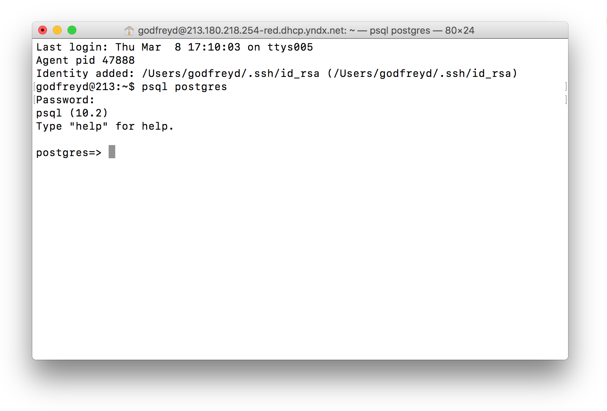
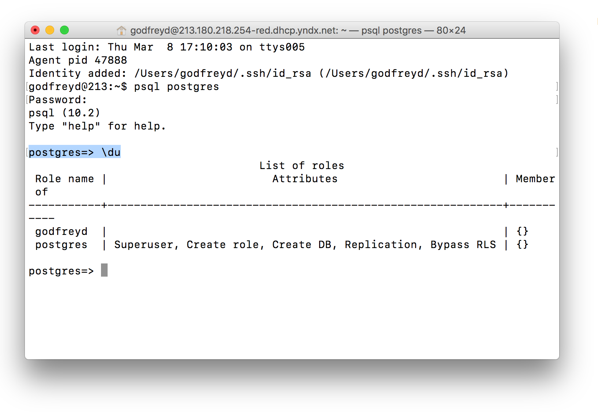

# Работа с Postgres

* [Проверка версии Postgres](#Проверка-версии-postgres)
* [Обновление Postgres](#Обновление-postgres)
* [Вход в Postgres](#Вход-в-postgres)
* [Установка пароля пользователю](#Установка-пароля-пользователю)
* [Добавление нового пользователя](#Добавление-нового-пользователя)
* [Просмотр ролей пользователей](#Просмотр-ролей-пользователей)
* [Добавление роли пользователю](#Добавление-роли-пользователю)
* [Просмотр списка баз данных](#Просмотр-списка-баз-данных)
* [Создание базы данных](#Создание-базы-данных)
* [Удаление баз данных](#Удаление-баз-данных)
* [Переименование баз данных](#Переименование-баз-данных)
* [Вход в базу данных](#Вход-в-базу-данных)
* [Создание таблиц](#Создание-таблиц)
* [Просмотр существующих таблиц](#Просмотр-существующих-таблиц)
* [Выход из Postgres](#Выход-из-postgres)

## Проверка версии Postgres

Чтобы проверить какая версия Postgres установлена на компьютер, выполните команду:

```bash
$ psql -V
```

## Обновление Postgres

Чтобы обновить Postgres, выполните команду:

```bash
$ brew upgrade postgresql
```

## Вход в Postgres

При установке Postgres, по умолчанию устанавливается утилита `psql`, помогающая администрировать базу, без необходимости знать фактические SQL-команды. Также создаются одноименные база данных и пользователь `postgres` (по умолчанию без пароля).

На моем Mac сеанс всегда `godfreyd@213:~`. Поэтому при первом входе в Postgres, может возникнуть ошибка, что Postgres не знает такого пользователя. Как изменить пользователя сеанса см. в [FAQ](#Как-управлять-пользователями-в-mac-os).

Чтобы войти в Postgres под `postgres`, не переключая пользовательскую сессию, выполните команду:

```bash
# Войти под `postgres`
$ psql -U postgres
```

Ответ



## Установка пароля пользователю

Чтобы установить пароль пользователю:

1. Войдите в Postgres.

   ```bash
   # Войти под `postgres`
   $ psql -U postgres
   ```

2. Задайте пароль пользователю `postgres`.

   ```sql
   ALTER USER postgres with password 'Q123456q';
   ```

## Добавление нового пользователя

Чтобы добавить нового пользователя (например, `godfreyd`):

1. Войдите в Postgres, например, под `postgres` (пароль 'Q123456q').

   ```bash
   # Войти под `postgres`
   $ psql -U postgres
   ```

   > **Примечание.** Также можно войти, переключив сеанс пользователя на `postgres`. Выполните команду: ```bash $ su postgres``` → войдите в Postgres: ```bash $ psq```.

2. Создайте нового пользователя (например, `godfreyd`):

   ```sql
   CREATE USER godfreyd WITH PASSWORD '*********';
   ```

Теперь можно заходить в Postgres не переключая пользовательскую сессию (по умолчанию: `godfreyd@213:~`).

## Просмотр ролей пользователей

Чтобы посмотреть роли пользователей, выполните команду:

```sql
\du
```

Ответ



## Добавление роли пользователю

Чтобы добавить роль пользователю (например, `godfreyd`):

1. Войдите в Postgres под `postgres` (пароль 'Q123456q').

   ```bash
   # Войти под `postgres`
   $ psql -U postgres
   ```

2. Задайте роль пользователю `godfreyd`.

   ```sql
   ALTER ROLE godfreyd CREATEDB Superuser;
   ```

   Теперь пользователя `godfreyd` может создавать базы данных и обладает правами суперпользователя.

## Просмотр списка баз данных

Чтобы посмотреть список баз данных, выполните команду:

```sql
# Или просто \l
\list
```

## Создание базы данных

Чтобы создать базу данных `test`, выполните команду:

```sql
CREATE DATABASE test;
```

## Удаление баз данных

Чтобы удалить базу данных:

1. Войдите в Postgres под собственником базы данных (например, `godfreyd`).

   ```bash
   $ psql
   ```

2. Выполните команду:

   ```sql
   DROP DATABASE test;
   ```

## Переименование баз данных

Чтобы переименовать базу данных, например, `spreemarketplacetest` в `spreemarketplacedev`, выполните команду:

```sql
ALTER DATABASE "spreemarketplacetest" RENAME TO "spreemarketplacedev";
```

## Вход в базу данных

Чтобы войти в определенную базу данных, например, `spreemarketplacedev`:

1. Войдите в Postgres.

   ```bash
   $ psql
   ```

2. Выполните команду:

   ```sql
   godfreyd=> \connect spreemarketplacedev
   ```

## Создание таблиц

Существует несколько способов создать таблицу в PostgreSQL. Мы рассмотрим создание через Rails-приложение.

Чтобы создать таблицу:

1. Создайте [модель](#Создание-новой-модели).
2. Опишите таблицу в файле миграции модели (мы рассмотрим на примере [модели Page](#Создание-новой-модели). В нашем случае путь к файлу миграции — `db/migrate/20180309161342_create_pages`).

   **Пример**

   ```ruby
   class CreatePages < ActiveRecord::Migration[5.1]
     def change
       create_table :pages do |t|
           t.string :name, null: false, default: ''
           t.string :description, null: false, default: ''

        t.timestamps null: false
       end
    end
   end
   ```

3. Выполните миграцию, командой:

   ```bash
   $ rake db:migrate
   ```

> **Примечание.** Как посмотреть список существующих таблиц см. [Просмотр существующих таблиц](#Просмотр-существующих-таблиц).

## Просмотр существующих таблиц

Чтобы посмотреть список таблиц определенной базы данных:

1. Войдите в Postgres.

   ```bash
   $ psql
   ```

2. Соеденитесь с базой данных:

   ```sql
   godfreyd=> \connect spreemarketplacedev
   ```

3. Выполните команду:

   ```sql
   spreemarketplacedev=# \dt
   ```

## Выход из Postgres

Чтобы выйти из базы Postgres, выполните команду:

```sql
postgres=> \q
```
