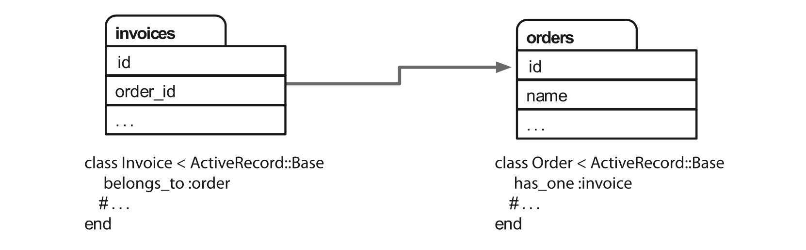
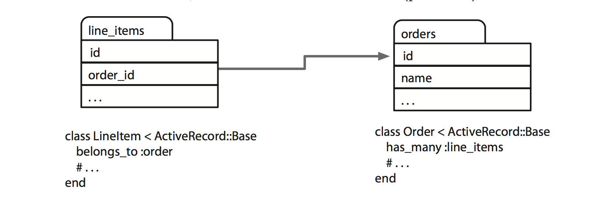
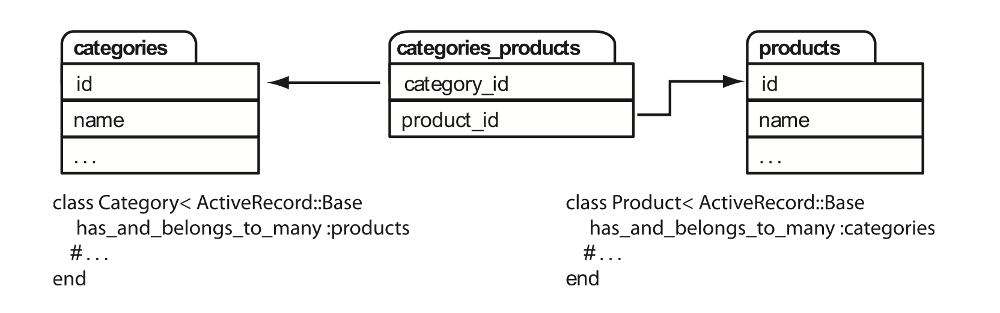
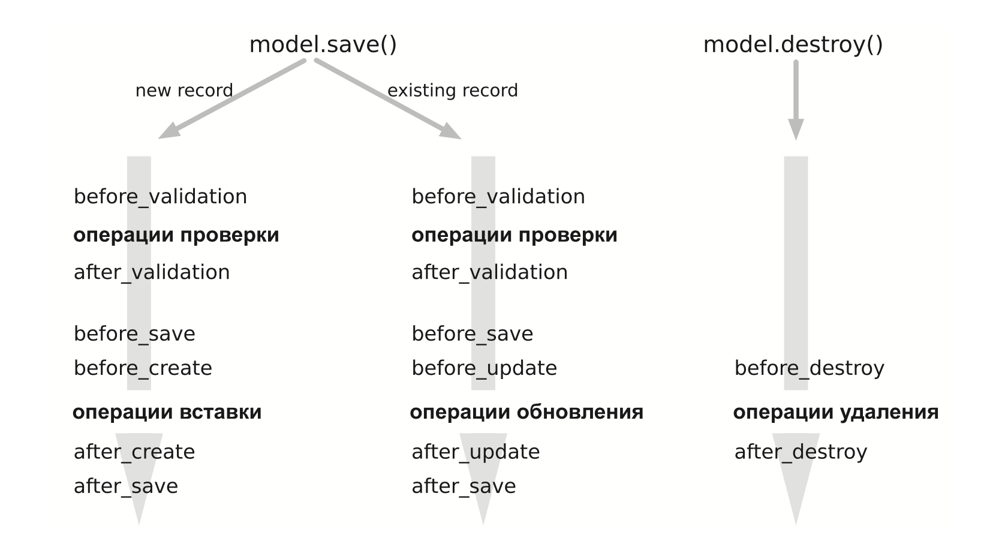
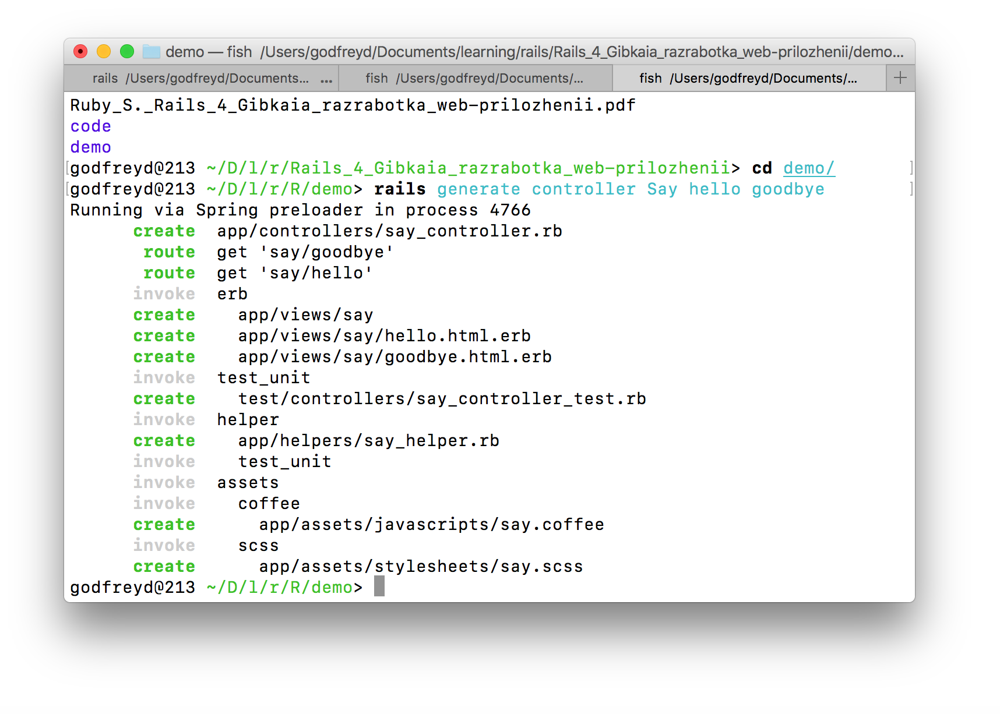
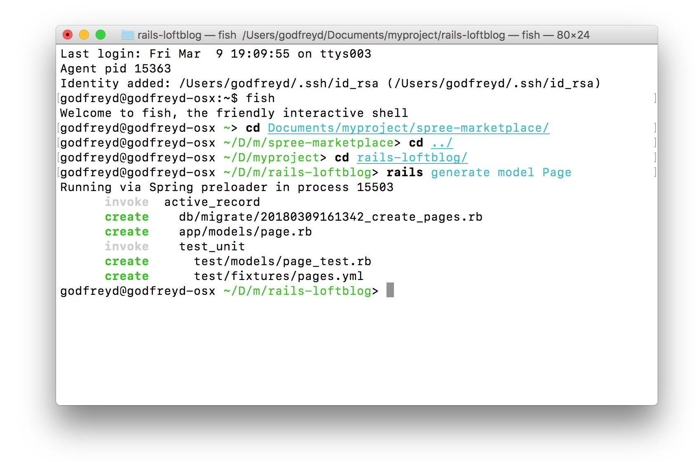

# Введение в Rails

* [Модели, представления и контроллеры](#Модели-представления-и-контроллеры)
* [Роутинг](#Роутинг)
* [Active Record](#active-record)
* [Action Pack](#action-pack)
* [Создание нового контроллера](#Создание-нового-контроллера)
* [Создание новой модели](#Создание-новой-модели)
* [Создание каркаса (scaffold)](#Создание-каркаса--scaffold)
* [Тестирование](#Тестирование)
* [Валидация данных](#Валидация-данных)
* [Переключение режимов](#Переключение-режимов)
* [Метод render()](#Метод-render)

## Модели, представления и контроллеры

**Модель** отвечает за поддержку состояния приложения. Иногда это состояние является кратковременным, продолжающимся только на время нескольких взаимодействий с пользователем. А иногда состояние является постоянным и сохраняется вне приложения, чаще всего в базе данных.
Модель — это не просто данные. В ней прописаны все бизнес-правила, применяемые к этим данным.

**Представление** отвечает за формирование пользовательского интерфейса, который обычно основан на данных модели. Представление в Rails выражается встроенными в Ruby шаблонами ERb. ERb можно также использовать для конструирования на сервере JS-фрагментов кода, выполняемых в браузере. Эта технология отлично подходит для создания динамичных AJAX-интерфейсов.

**Контроллеры** организуют работу приложения. Они воспринимают события внешнего мира (обычно ввод данных пользователем), взаимодействуют с моделью и отображают соответствующее представление для пользователя.

* Отвечают за перенаправление внешних запросов внутренним действиям. Они отлично справляется с удобными для человеческого восприятия URL-адресами.
* Управляют кэшированием, ускоряющим работу приложения в несколько раз.
* Управляют вспомогательными модулями, расширяющими возможности шаблонов представлений без увеличения объема их кода.
* Управляют сессиями, дающими пользователям ощущение непрерывного взаимодействия с нашими приложениями.

## Роутинг

Подробнее см. http://guides.rubyonrails.org/routing.html

## Active Record

Active Record — это ORM-библиотека, предоставляемая Rails.  Она строго следует стандартам ORM-модели: таблицы отображаются на классы, строки — на объекты, а столбцы — на свойства объекта. За счет этой библиотеки обеспечивается связь между моделью и базой данных.

Active Record избавляет нас от возни с исходной базой данных, позволяя спокойно работать над бизнес-логикой.

`ActiveRecord::Migration` — класс Migration модуля ActiveRecord позволяет создавать, удалять, изменять таблицы в БД.

**Пример**

```ruby
require 'active_record'
class Order < ActiveRecord::Base
end
order = Order.find(1)
order.pay_type = "Заказ товара"
order.save
```

* [Определение связей в моделях](#Определение-связей-в-моделях)
* [CRUD — Create, Read,  Update, Delete](#crud--create-read-update-delete)
* [Обратные вызовы Active Record](#Обратные-вызовы-active-record)

### Определение связей в моделях

Active Record поддерживает три типа связей между таблицами: «один к одному», «один ко многим» и «многие ко многим». Эти связи указываются путем добавления к моделям объявлений `has_one`, `has_many`, `belongs_to` и еще одного объявления с удивительным названием — `has_and_belongs_to_many`. 

**Связь «Один к одному»**

У одного заказа (Order) один счет (Invoce):



> **Важно** Модель для таблицы, имеющей внешний ключ (order_id), всегда содержит объявление `belongs_to`.

**Связь «Один ко многим»**

У одного заказа (Order) много товарных позиций (Line item):



> **Важно** Модель для таблицы, имеющей внешний ключ (order_id), всегда содержит объявление `belongs_to`.

**Связь «Многие ко многим»**

Товар может принадлежать многим категориям, и каждая категория может содержать множество товаров. Это и является примером связи «многие ко многим». Похоже на то, что каждая из взаимосвязанных сторон содержит коллекцию элементов другой стороны.



Rails реализует связи «многие ко многим», используя промежуточную объединительную таблицу. В ней содержатся пары внешних ключей, связывающие две заданные таблицы.

Active Record предполагает, что имя этой объединительной таблицы является объединением имен двух заданных таблиц, следующих в алфавитном порядке. В нашем примере объединяются таблицы `categories` и `products`, поэтому Active Record будет искать объединительную таблицу по имени `categories_products`.

### CRUD — Create, Read,  Update, Delete

**Создание новых строк**

Чтобы создать новые строки в таблице заказов, необходимо вызвать метод `Order.new()` и заполнить значениями свойства (соответствующие столбцам в базе данных). В завершение необходимо вызвать принадлежащий объекту метод `save()` для сохранения заказа в базе данных. Без этого вызова заказ будет существовать только в нашей локальной памяти.

```ruby
an_order = Order.new
an_order.name     = "Dave Thomas"
an_order.email    = "dave@example.com"
an_order.address  = "123 Main St"
an_order.pay_type = "check"
an_order.save
```

Можно сделать все то же самое, не создавая локальную переменную:

```ruby
Order.new do |o|
    o.name = "Dave Thomas" #...
    o.save
end
```

Метод `create()` автоматически сохраняет заказ в БД.

```ruby
an_order = Order.create(
    name: "Dave Thomas",
    email: "dave@example.com",
    address: "123 Main St",
    pay_type: "check")
```

Практический смысл в передаче методам `new()` и `create()` хэша значений обусловливается возможностью конструирования объектов модели непосредственно из параметров формы:

```ruby
@order = Order.new(order_params)
```

**Удаление строк**

Active Record поддерживает два способа удаления строк. Для начала есть два метода, определенные на уровне класса, `delete()` и `delete_all()`.

```ruby
Spree::Role.delete(1)
Spree::Role.delete_all(["name > ?", @old_role])
```

Второй способ удаления строк, предоставляемый Active Record, основан на применении метода `destroy()` (которому передается идентификатор (id) или массив идентификаторов) и `destroy_all()` (которому передается условие).

```ruby
Order.destroy_all(["shipped_at < ?", 30.days.ago])
```

### Обратные вызовы Active Record



Обратные вызовы `before_validation` и `after_validation` также допускают использование параметра `on::create` (при создании) или параметра `on::update` (при обновлении), наличие которых приводит к тому, что соответствующий обратный вызов осуществляется только при выбранной этими аргументами операции.

Есть два основных способа реализации функций обратного вызова 
Более предпочтительный способ определения функции обратного вызова заключается в объявлении обработчиков. Обработчик может быть либо методом, либо блоком. Связь обработчика с конкретным событием осуществляется путем использования метода класса, названного по имени события. Чтобы связать метод, его нужно объявить закрытым (private) или защищенным (protected) и указать его имя в виде обозначения при объявлении обработчика. Для указания блока нужно просто добавить этот блок после объявления. В качестве аргумента этот блок получает объект модели.

**Пример**

```ruby
class Order < ActiveRecord::Base
    before_validation :normalize_credit_card_number
    after_create do |order|
        logger.info "Заказ #{order.id} создан"
    end
    protected
    def normalize_credit_card_number
        self.cc_number.gsub!(/[-\s]/, '')
    end
end
```

## Action Pack

Action Pack — это Rails-компонент, осуществляющий поддерждку контроллеров и представлений. Контроллер снабжает представление данными, и он же воспринимает события от страниц, сгенерированных представлениями.

## Создание нового контроллера

Например, для создания контроллера под названием Say, нужно убедиться, что мы находимся в директории проекта, и запустить команду, передав ей имя создаваемого контроллера и имена действий, предназначенных для его поддержки:

```bash
$ rails generate controller Say hello goodbye
```
Интерпретация:

```text
$ rails создай controller Say с действиями (методами): hello и goodbye
```

Данная команда добавит новые Ruby-сценарии и каталоги к нашему приложению:



Действия:

```ruby
create  app/controllers/say_controller.rb       # Создался контроллер
route                                           # Прописались пути в `config/routes.rb`
    get 'say/hello'                             
    get 'say/goodbye'
invoke  erb
create    app/views/say                         # Создалась директория `app/views/say`
create    app/views/say/hello.html.erb          # Создался файл представления для hello
create    app/views/say/goodbye.html.erb        # Создался файл представления для goodbye
invoke  test_unit
create    test/controllers/say_controller_test.rb   # Создался файл теста для контроллера
invoke  helper
create    app/helpers/say_helper.rb             # Создался хелпер
invoke    test_unit
invoke  assets
invoke    coffee
create      app/assets/javascripts/say.coffee   # Создался JS-файл
invoke    scss
create      app/assets/stylesheets/say.scss     # Создался файл стилей
```

Чтобы убедиться, что контроллер отвечает, перейдите по адресу [localhost:3000/say/hello](http://localhost:3000/say/hello).

## Создание новой модели

Модель отвечает за работу с базой данных. Мы установили PostgreSQL, настроили взаимодействие с ней. Теперь можно создавать модели и описывать логику работы нашего приложения.

Чтобы создать модель (например, `Page`), выполните команду:

```bash
$ rails generate model Page
```

Данная команда добавит новую Ruby-модель и файлы нашему приложению:



> **Примечание.** О том, как создавать таблицы в: 
> * PostgreSQL см. раздел [работа с Postgres](../postgres/README.md).

## Создание каркаса (scaffold)

Scaffold — это полный набор из модели, миграции базы данных для этой модели, контроллера для воздействия на нее, представления для просмотра и обращения с данными и тестовый набор для всего этого.

Например, чтобы создать представление, контроллер, модель под названием Product, таблицу данных по имени products, необходимо выполнить команду:

```bash
$ rails generate scaffold Product \title:string description:text image_url:string price:decimal
```

После этого необходимо применить созданную миграцию к разработческой базе данных:

```bash
$ rake db:migrate
```

Готово! Для просмотра товаров перейте по адресу [localhost:3000/products](http://localhost:3000/products).

## Тестирование

Чтобы запустить тесты в Rails, выполните команду:

```bash
$ rake test
```

В выводе этой команды должны присутствовать две строки, в каждой из которых сообщается: 0 failures, 0 errors (0 сбоев, 0 ошибок). Это относится к тестам модели и контроллера, которые Rails генерирует вместе с созданием временной платформы. Пока эти тесты имеют минимальный объем, но сам факт их присутствия и успешного прохождения должен вселить в вас уверенность.

> **Примечание.** Следует учесть, что при использовании базы данных, отличной от SQLite3, тестирование может не пройти  Проверьте содержимое своего файла database.yml и изучите материал главы 23 учебника «Rails 4. Гибкая разработка веб-приложений».

## Валидация данных

В Rails имеется нативный метод `validates()`. Стандартным местом для валидации полей является модель.

**Пример**

```rb
class Product < ApplicationRecord
    validates :title, :description, :image_url, presence: true
    validates :price, numericality: {greater_than_or_equal_to: 0.01}
    validates :title, uniqueness: true
    validates :image_url, allow_blank: true, format: {
        with: %r{\.(gif|jpg|png)\Z}i,
        message: 'URL должен указывать на изображение формата GIF, JPG или PNG.'
    }
end
```

Часть инструкции: 

* `presence: true` предписывает валидатору проверять наличие данных в каждом из указанных полей.
* `uniqueness: true` гарантирует, что поле не будет повторяться в таблице `products`.
* `numericality: {greater_than_or_equal_to: 0.01}` разрешает заполнять поле числами больше или равными значению 0,01.
* `format` определяет соответствие значения поля регулярному выражению.

> **Примечание.** Часть инструкции `allow_blank: true` позволяет избежать получение нескольких сообщений об ошибках применимых к одному полю.

## Переключение режимов

Чтобы переключиться в production-режим, выполните команду:

```bash
% bin/rails db:migrate RAILS_ENV=production
```

## Метод render()

Встречается и в контроллерах и в представлениях.

* [:action](#action)
* [:template](#template)
* [:file](#file)
* [:inline](#inline)
* [:text](#text)

### :action

Используется для ссылки на какое-либо действие.

**Пример**

```ruby
class ApplicationController < ActionController::Base
    def new
        ...     # Действие может быть пустым
    end
    def create
        ...
        render :action => "new"
    end
end
```

### :template

Используется для рендеринга постороннего шаблона.

**Пример**

```ruby
render :template => "abuse/report"      # рендеринг app/views/abuse/report.html.erb
```

### :file

Используется для рендеринга постороннего шаблона. Указывается абсолютный путь на файл.

**Пример**

```ruby
render :file => "/railsapp/myproject/app/views/abuse/report"      # рендеринг app/views/abuse/report.html.erb
```

### :inline

Используется для рендеринга встроенного шаблона. 

> **Примечание.** В контроллерах так делать не стоит.

```ruby
render :inline => "<%= result(@name, 'name') %>"
```

### :text

Используется для рендеринга текстовых сообщений. 

```ruby
render :text => 'Данные приняты!'
```
